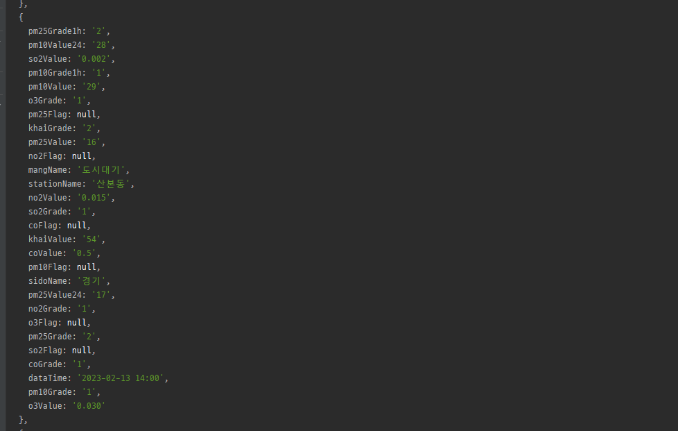

## APIs
### [공공데이터](https://data.go.kr) api를 활용한 실습
#### [미세먼지](./crawling04.js)
* 해당 데이터를 가져오기 위해서는 공공데이터 가입 및 [미세먼지 오픈api](https://www.data.go.kr/data/15073885/openapi.do)활용 신청 필수이다.
1. 필수 라이브러리 설치(ajax library, xml library(필요시!))
```javascript
    const axios =  require('axios');
```
2. 비동기 입출력 지원함수 만들기
    1. 불러올 url및 user_agent설정(그 외 값들은 필요에따라서 해당 페이지에서 제공한 가이드에따라 추가할 것)
   ```javascript
       async function main(){
           const url ='입력될 url';
           const params ={
               'serviceKey':'받은 서비스 키',
               'returnType' : 'json',
               'sidoName':'경기',
               'numOfRows':500,
               'ver':1.3
           }
           
           const headers =  {'UserAgent':'Mozilla/5.0 (Windows NT 10.0; Win64; x64) AppleWebKit/537.36 (KHTML, like Gecko) Chrome/109.0.0.0 Safari/537.36 Edg/109.0.1518.78'};
           
           
       }
   ```
   > 입력될 url위치 (마이페이지> 신청한 api상세 페이지에서 확인가능) <br>
   > 
   > 받은 서비스키 위치 <br>
   > 

    2. axios를 활용하여 접속 (main 함수 안에서 추가되어야 함!)
   ```javascript
       const json = await axios.get(url,{
            params : params, headers: headers
        });
      console.log(json.data);
   ```
    * 성공 시 아래와 같이 나옴
   > 결과 <br>
   > 

   3. data의 내용 불러오기(main 함수 안에서 추가되어야 함!)
   ```javascript
    let items = json.data['response']['body']['items'];
    console.log(items);
   ```
   > 결과 <br>
   > 
   
   4. 정보 출력해보기  (main함수 안 : 출력내용, main 함수 바깥 : 미세면지 구분함수 )
   ```javascript
    async function main(){
            ....    
       items.forEach((e,idx)=>{
        console.log(e);
        console.log((idx+1)+e.sidoName + e.stationName , e.pm10Value,e.pm25Value, pmGrade(e.pm10Grade) , pmGrade(e.pm25Grade)  , e.dataTime);
   }
   function pmGrade(e){
    let emojis = '😍 😯 😑 🤯'.split(' ');
    return (Number.isInteger(parseInt(e)))?emojis[parseInt(e)-1] : '-';
   }
   
   ```
   > 결과 <br>
   > 


#### [코로나19](./crawling05.js)
* 해당 데이터를 가져오기 위해서는 공공데이터 가입 및 [코로나19 오픈api](https://www.data.go.kr/data/15098776/openapi.do)활용 신청 필수이다.
* 해당 데이터는 xml이 기본으로 제공되는 데이터로 xml>json 변경 라이브러리인 XMLParser가 필요하다.
1. ajax, xmlparser 설치 및 가져오기
```javascript
   const axios =  require('axios');
   const {XMLParser}= require('fast-xml-parser');
```
2. 메인함수 생성 및 url세팅 , header세팅
```javascript 
   async function main(){
      const url = 'url';
      const params ={
         'serviceKey':'서비스키',
         // 대문자 json으로 하면 json확인가능
         'apiType':'xml',
         'std_day':'2023-02-13',
         'gubun':''
      }
   }
   const headers= {'UserAgent':'Mozilla/5.0 (Windows NT 10.0; Win64; x64) AppleWebKit/537.36 (KHTML, like Gecko) Chrome/109.0.0.0 Safari/537.36 Edg/109.0.1518.78'};
```
> 입력될 url위치 (마이페이지> 신청한 api상세 페이지에서 확인가능) <br>
> 
> 받은 서비스키 위치 <br>
> 

3. axios로 접속[메인함수]
```javascript 
   async function main() {
                 ⁞
      const xml = await axios.get(url, {params: params, headers: headers});
   }
```

4. xmlparser를 활용해서 json으로 변경[메인함수]
```javascript 
   async function main() {
                 ⁞
      const parser = new XMLParser();
      let json = parser.parse(xml.data);
   }
```
5. json파일 불러온 후 출력하기[메인함수]
```javascript 
   async function main() {
                 ⁞
         let items = json['response']['body']['items']['item'];
         
         items.forEach(e=>{
                console.log(`지역${e.gubun},
                전일 확진자 수:${e.incDec},
                총 확진자수 :${e.defCnt}, 
                누적 사망자 수 :${e.deathCnt}, 
                측정일 :${e.stdDay}`);
         });
   }
```
> 결과 <br>
> 