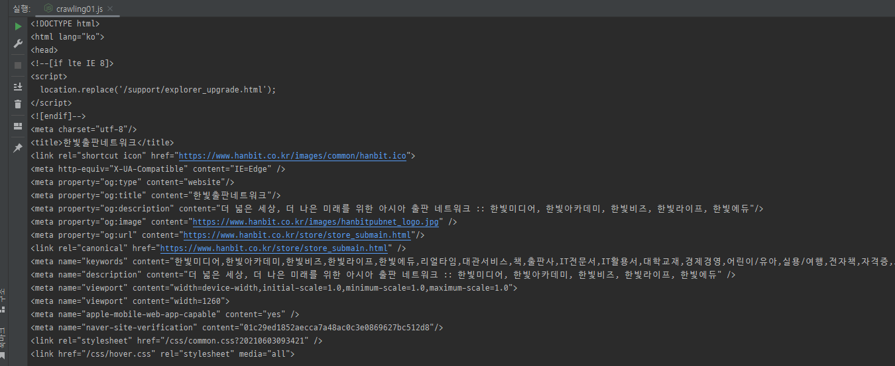
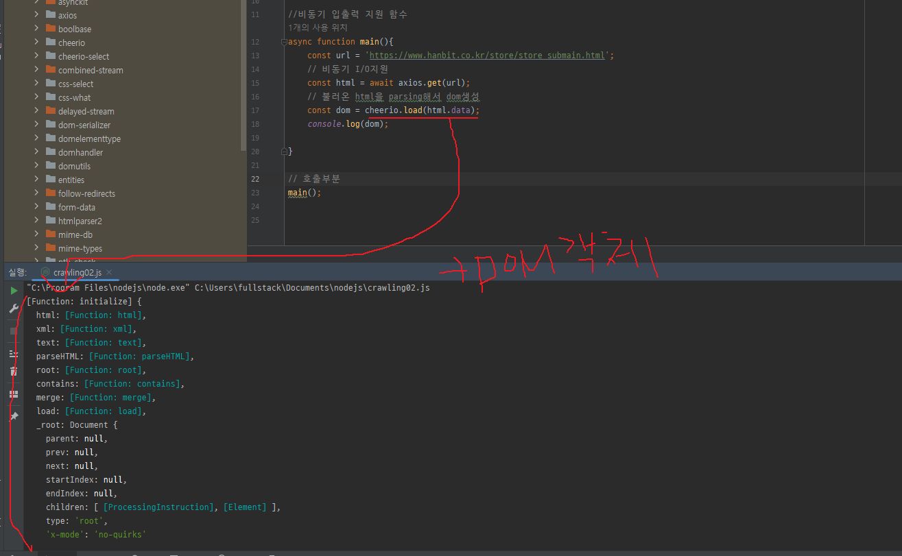
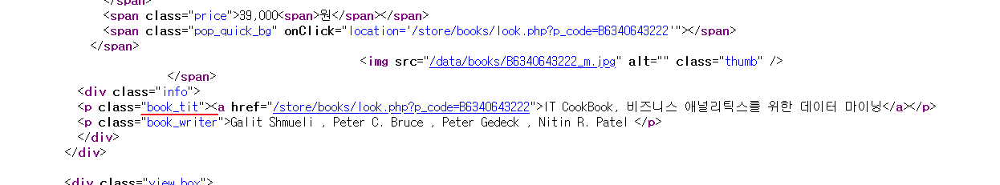
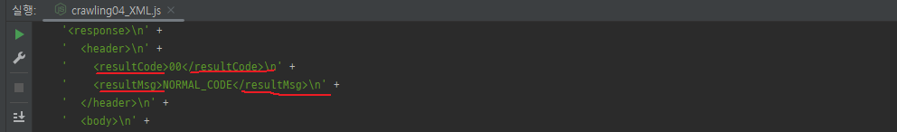
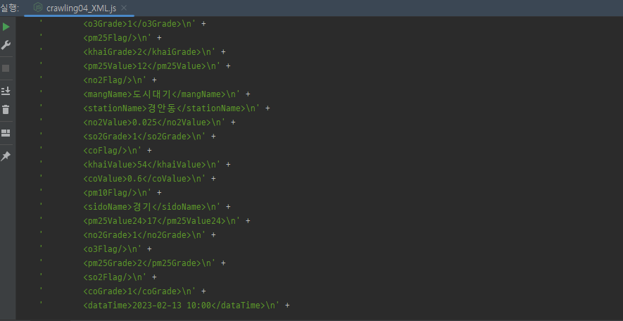
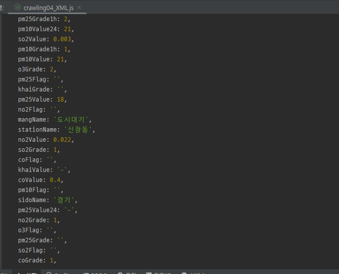
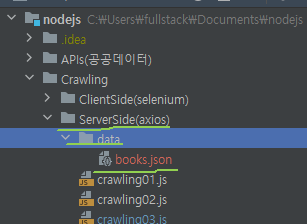

# 웹스크래핑/크롤링
* 웹 스크래핑은 웹페이지의 정보를 프로그램을 통해서 가져오는 것을 의미
* 우리가 신문을 스크랩 하듯이, 웹페이지를 스크랩 해서 정보를 저장하는 것이 가능
* 비정상적인 접근 시도시 접속을 금지하는 경우도 있으니 조심해야 할 것!
* 크롤링은 남의자산을 불법적으로 가져오는 케이스가 발생할수있다.
* 따라서 크롤링에대해서 조심성을 가지고 접근 해야한다.
* 크롤링으로 인한 법정공방 사례
* 잡코리아-사람인, 야놀자-여기어때, 네이버-다윈중개, 링크드인-하이큐랩스
* 크롤링/스크래핑 허용여부는 robots.txt에 명시되어 있음
> 참고 <br>
> 

## 크롤링의 제약
* 일반적으로 사용하는 axios는 서버사이드에서 제공된 html파일에 대해서만 크롤링 할 수 있다.
* 클라이언트 사이드에서 작동되는 ajax통신을 바탕으로 나오는 html데이터에 대해서는 가져올 수 없다.

## 라이브러리
### Axios
* ajax통신을 가능하게 만들어주는 라이브러리
```javascript
// hanbit.co.kr사이트에서 새로나온 책에대한 정보를 긁어오기
// https://www.hanbit.co.kr/store/store_submain.html
// 사용할 패키지 가져오기 : require(패키지명)
const axios =  require('axios');
const main = ()=>{
    // 접속할 url지정
    const url = 'https://www.hanbit.co.kr/store/store_submain.html';
    // axious로 접속해서 html을 불러옴
    axios.get(url)
        .then((html)=>{
            // 불러온 html을 콘솔에 출력
            console.log(html.data);
        })
        .catch((error)=>{
            console.log(error);
        });
};

// 호출부분
main();
```
> 결과<br>
> 

### cheerio
* ajax통신을 통한 웹문서를 dom형태의 객체로 가져오게 만들어주는 라이브러리
* 즉, 받아온 페이지를 파싱하여 전체 페이지 중에서 필요한 부분의 정보만을 가져올 수 있음
```javascript
// hanbit.co.kr사이트에서 새로나온 책에대한 정보를 긁어오기
// https://www.hanbit.co.kr/store/store_submain.html

// 사용할 패키지 가져오기 : require(패키지명)
// ajax 라이브러리
const axios =  require('axios');
// dom라이브러리 alt+enter는 최신버전만 다운받음 , 특정버전을 원할때 npm 명령어 필요
const cheerio =  require('cheerio');


//비동기 입출력 지원 함수
async function main(){
    const url = 'https://www.hanbit.co.kr/store/store_submain.html';
    // 비동기 I/O지원
    const html = await axios.get(url);
    // 불러온 html을 parsing해서 dom생성
    const dom = cheerio.load(html.data);
    console.log(dom);

}

// 호출부분
main();

```
> 결과<br>
> 


#### 응용 
* cheerio사용을 통한 dom객체 내의 책 이름 가져오기
* 크롤링하려는 사이트의 책 타이틀의 이름을 가진 dom을 먼저 파악해야한다.
> 참고 <br>
> 

* dom을 파악하고 dom()함수를 사용해서 해당 설정에 맞는 dom과 그에따른 텍스트를 출력한다.
```javascript
// hanbit.co.kr사이트에서 새로나온 책에대한 정보를 긁어오기
// https://www.hanbit.co.kr/store/store_submain.html

// 사용할 패키지 가져오기 : require(패키지명)
// ajax 라이브러리
const axios =  require('axios');
// dom라이브러리 alt+enter는 최신버전만 다운받음 , 특정버전을 원할때 npm 명령어 필요
const cheerio =  require('cheerio');


//비동기 입출력 지원 함수
async function main(){
    const url = 'https://www.hanbit.co.kr/store/store_submain.html';
    // 비동기 I/O지원
    const html = await axios.get(url);
    // 불러온 html을 parsing해서 dom생성
    const dom = cheerio.load(html.data);

    // css선택자로 도서제목을 담고있는 요소 지정
    let elements = dom('.book_tit');

    //찾은 요소를 순회하면서 요소의 텍스트 출력
    elements.each((idx,title)=>{
        console.log(dom(title).text());
    });

}

// 호출부분
main();
```

### XMLParser
* 해당라이브러리는 contructor형태로 가져오기때문에 !반드시! 아래와 같이 불러오는 이름을 명시해야한다.
```javascript
const {XMLParser}= require('fast-xml-parser');
```
* xml파일을 가져올때 사용하는 라이브러리이다.
* xml형식의 파일은 다음과 같이 시작태그와 끝태그로 구분되어있어 불필요하게 데이터 용량이 높아지게 된다.
> 예시이미지 <br>
> 

* 따라서 XMLParser를 이용하여 다음과 같이 json 타입의 데이터로 출력할 수 있다.
```javascript
    // ajax 라이브러리
    const axios =  require('axios');
    // xml>json 변환 라이브러리
    const {XMLParser}= require('fast-xml-parser');
    
    async function main(){
        const url = 'http://apis.data.go.kr/B552584/ArpltnInforInqireSvc/getCtprvnRltmMesureDnsty';
        const params ={
            'serviceKey':'9CGvwEOuD7B/lmq152FgujYXfExIJvXhfq4WpVdI1OUEEnpVV24skweMDzXeZ4blzuZg3wYY9bmT4PPwJqWCAw==',
            // 리턴타입 xml 설정
            'returnType':'xml',
            'sidoName':'경기',
            'numOfRows':500,
            'ver':1.3
        }
        
        //데이터 받아올 시 사이트처럼 useragent 부과
        const headers= {'UserAgent':'Mozilla/5.0 (Windows NT 10.0; Win64; x64) AppleWebKit/537.36 (KHTML, like Gecko) Chrome/109.0.0.0 Safari/537.36 Edg/109.0.1518.78'};
        
        // ajax통신으로 xml데이터 받아오기
        const xml = await axios.get(url,{
            params : params, headers: headers
        });
        
        //xml > json 변환
        const parser = new XMLParser();
        let json = parser.parse(xml.data);
        
        let items = json['response']['body']['items'];
        console.log(items['item']);
    }
```
> 결과 <br>
> before(xml) <br>
> 
> after(json)<br>
> 

### 통신데이터 파일저장

## OS모듈
* 일반적인 운영체제의 정보처럼 사용할 수 있음
### path
* 폴더와 파일의경로를 쉽게조작하도록 해주는모듈
* 운영체제별로 경로구분자가 다르기때문에 필요함 (window:\ linux:/)

#### path.join
* 상대경로를 처리하여 경로를 수월하게처리할 수 있음

### fs
* 파일접근 모듈로 파일생성, 삭제, 읽기, 쓰기가 가능하다.
* 대부분의 경우 비동기메서드가 적합하다.

#### readFile
* 파일을 읽기

#### readFileSync
* 비동기처리 파일 읽기

#### writeFile
* 파일을 생성

#### writeFileSync
* 비동기처리 파일 생성

#### [예시](/crawling03.js) 
* [출판회사](https://www.hanbit.co.kr/store/books/new_book_list.html)의 책 리스트를 가져오고 파일로 저장하기

1. 위에 연결 후 가져오는 부분은 [cheerio](#cheerio)에서 참고 할것
2. 필요한 라이브러리 세팅
```javascript
// ajax 라이브러리
const axios =  require('axios');
// dom라이브러리 alt+enter는 최신버전만 다운받음 , 특정버전을 원할때 npm 명령어 필요
const cheerio =  require('cheerio');

//파일저장을 위한 라이브러리(내장 라이브러리이므로 설치가 따로 필요없음)
const fs = require('fs'); //파일 시스템 관련 라이브러리
const path = require('path'); //파일경로 관련 라이브러리


```
3. 파일 가져오기 [메인함수]
```javascript
async function main(){
    const url = 'https://www.hanbit.co.kr/store/books/new_book_list.html';
    // 수집한 정보를 저장하기위한 배열선언
    let [titles,writers,prices,books]=[[],[],[],[]];


    // axios로 접속해서 html불러오기
    const html = await axios.get(url,{
        // 서버 요청시 user-agent  헤더 사용 : nodejs가 브라우져와같이 긁어갈 수 있게 함.
        headers:{'UserAgent':'Mozilla/5.0 (Windows NT 10.0; Win64; x64) AppleWebKit/537.36 (KHTML, like Gecko) Chrome/109.0.0.0 Safari/537.36 Edg/109.0.1518.78'}
    });
    // 불러온 html을 parsing해서 dom생성
    const dom = cheerio.load(html.data);

    // css선택자로 도서제목을 담고있는 요소 지정
    let elements = dom('.book_tit');
    let wtdom = dom('.book_writer');
    let prdom = dom('.price');

    //찾은 요소를 순회하면서 요소의 텍스트 출력
    elements.each((idx,title)=>{
        titles.push(dom(title).text());
        writers.push(dom(wtdom[idx]).text().replaceAll(' ',''));
        prices.push(parseInt(dom(prdom[idx]).text().replaceAll(/[,|원]/g,'')));
    });

    //수집한 정보들을 json 객체로 생성
    for(let i =0; i < titles.length;i++){
        let book ={};
        book.title = titles[i];
        book.writer = writers[i];
        book.price = prices[i];
        books.push(book);
    }

    //저장된 요소확인
    console.log(books);
}

// 호출부분
main();


```
4. 파일저장하기[메인함수]
```javascript
async function main(){
                     ⁞
  // 생성된 도서 객체를 json문자열로 변환하고
    const bookJSON = JSON.stringify(books);

    // 파일에 저장
    // data폴더가 존재하는지 확인하고 없으면 생성
    !fs.existsSync('data') && fs.mkdirSync('data');

    //저장위치와 파일명 지정후 파일에 저장
    //여기에서는 data라는 폴더에 book.json으로 저장할예정
    const fpath =  path.join(__dirname,'data','books.json');

    //파일을 넣어줌
    fs.writeFileSync(fpath,bookJSON);
}


```
> 결과 <br>
> 