#  데이터베이스
* 데이터베이스는 관련성을 가지며 중복이없는 데이터 집합을 의미
* 데이터베이를관리하는 시스템을 DBMS라고 한다 
* 서버에 데이터를 올리면 여러사람이 동시에 사용할 수있는 이점이있다.
* DBMS는 관계형인 RDBMS가 주로 사용됨
* DB설정은 주로 utf8mb4를 사용하는데, 이를 사용하는이유는 utf8+emoji를 사용할 수 있는 utf-8형식이기 때문이다.(한글, 이모티콘 사용가능)
* 
## SQL
* auto-increment 
* created at (time)...

## oracle 접속 라이브러리 설치
### 환경설정
1. [사이트](https://www.oracle.com/database/technologies/instant-client.html)를 방문한다.
2. 중간부분에 get oracle instant Client의 Download버튼을 클릭한다.
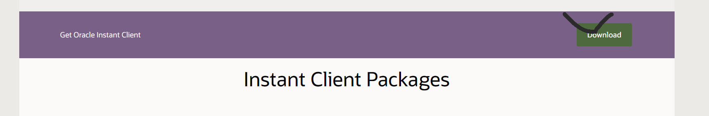<br>
3. window용을 클릭한다.<br>
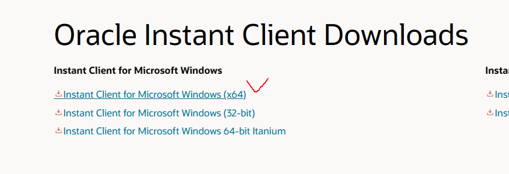<br>
4. 19.17.0.0.0 버전을 다운로드한다.<br>
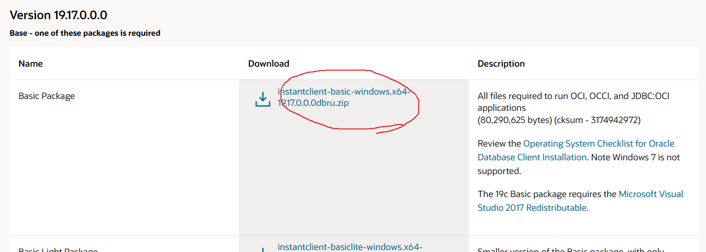<br>
5. C드라이브에 만들어 놓았던 java폴더에 압축을 푼다.<br>
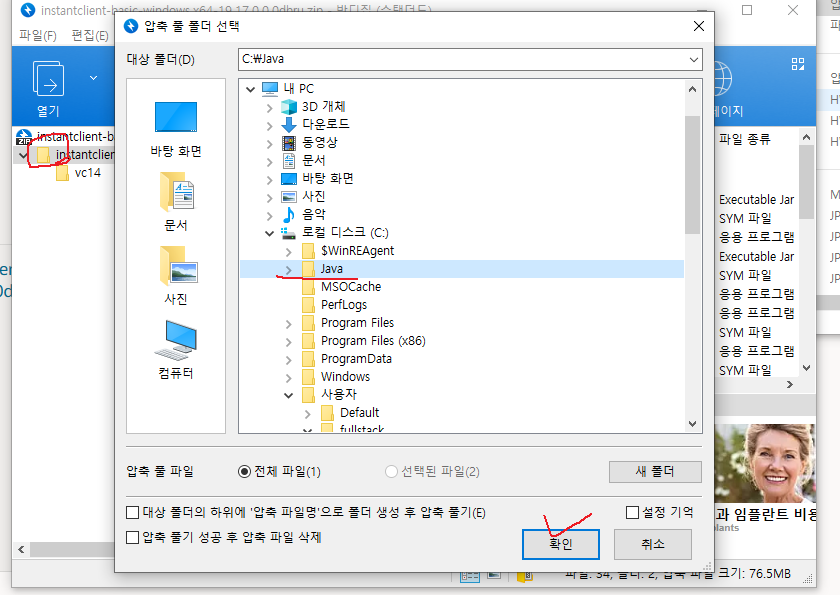 <br>
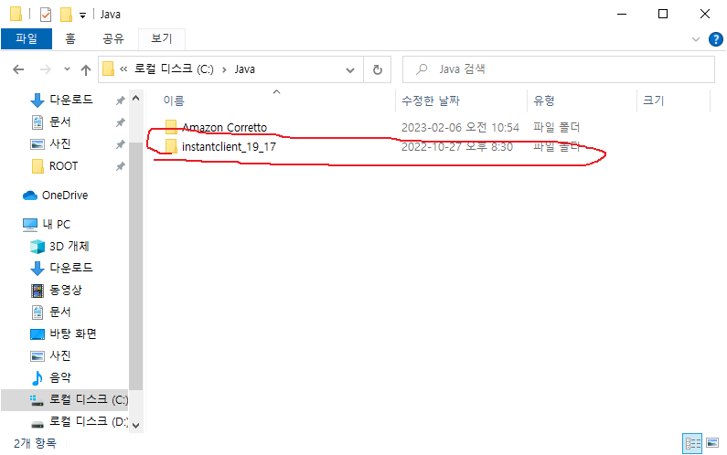<br>
6. 압축 푼 경로를 복사해 놓는다.<br>
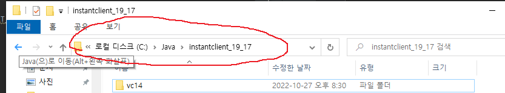<br>
7. 정보> 고급시스템 설정으로 들어간다.<br>
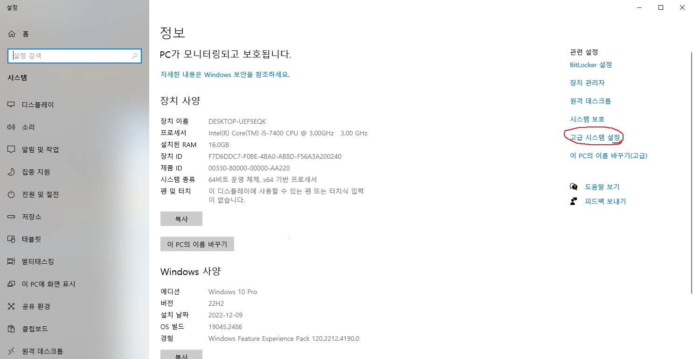<br>
8. 환경변수를 클릭한다. <br>
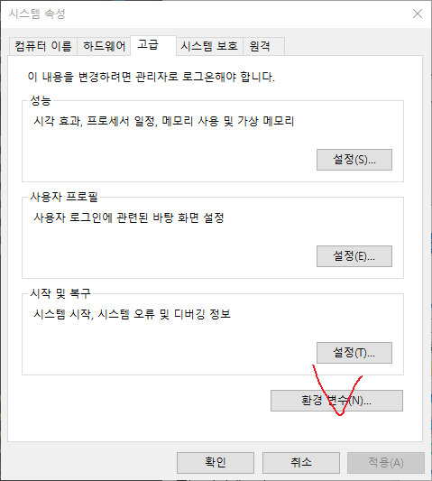<br>
9. path를 선택하고 편집을 클릭한다.<br>
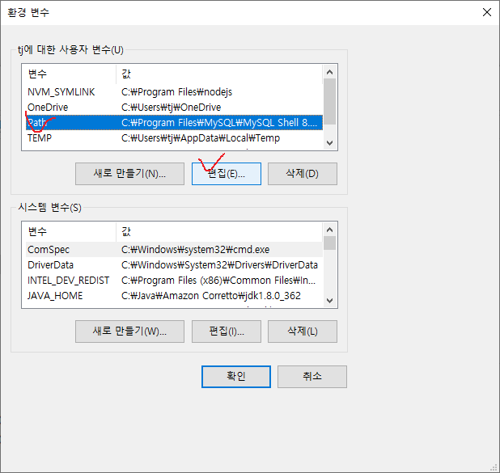<br>
10. 새로만들기 버튼을 클릭하소 6.에서 복사해놓은 경로를 추가한다.<br>
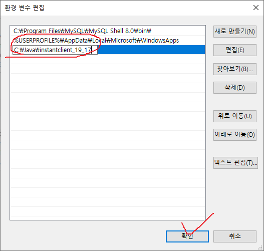<br>

### [사용하기](./oracle01.js)
1. oracledb라이브러리를 설치하고 불러온다.
```javascript
    const oracledb = require('oracledb');
```
2. 메인함수를 작성한다.
```javascript
async function main(){
}
main();
```
3. sql문과 parameter, option을 세팅한다.[메인함수]
```javascript
async function main(){
    //sql문 설정
    const sql = `select distinct * from 테이블 where 조건컬럼명=:조건명`;
    //parameter설정 (optional)
    let params = {'조건명':'조건작성'};
    //oracle db를 위한 옵션 정의
    let options ={
        //row result를 사용하기위해 필요함
        resultSet: true,
        outFormat: oracledb.OUT_FORMAT_OBJECT,
    };
}
```

4. 디비 연결객체를 작성하고 작업이 끝나면 oracle접속을 끊을 수 있도록 설정해준다.[메인함수]
```javascript
async function main(){
            ⁞
    // 디비연결 객체 선언
    let conn = null;
    try{
        //oracle instance clinet 초기화
        oracledb.initOracleClient(
            //oracle instance client 설치위치 설정
            {libDir:'설치위치'});
        
        //oracle 연결객체 설정
        conn = await oracledb.getConnection({
            user:'아이디',
            password:'패스워드',
            connectString:'접속호스트:1521/XE'
        });
        

    }catch (e) {
        console.log(e)
    }finally {
        //작업이 끝난후 오라클접속을 끊어줌
        if(conn){
            try{
                await conn.close();
                console.log('오라클 접속 해제성공');
            } catch (e){
                //에러발생시 에러 출력
                console.error(e);
            }
        }
    }
    
}
```

4. sql문을 입력하고 결과를 foramt에 맞춰서 출력한다.[메인함수]
```javascript

    try{
            ⁞
        //select쿼리용인 excute를 활용하여 쿼리 및 포맷을 입력한다.
        let result =  await conn.execute(sql,params,options);
        //실행결과를 결과집합 객체로 변환
        let rs = result.resultSet;
        //결과집합 객체의 각 요소를 순회하면서 내용 출력
        let row = null;
        while ((row = await rs.getRow())){
            console.log(row.컬럼명//대소문자구분);
        }
        //작업이 끝나면 결과집합 객체를 닫음
        await rs.close();
    }
            ⁞
    
```

### [사용하기](./mariadb01.js)
1. mariadb라이브러리를 설치하고 불러온다.
```javascript
// 마리아 db설치 및 불러오기
const mariadb = require('mariadb');
```
2. 메인함수를 제작한다.
```javascript
    async function main() {
        let conn =null;
    }
```

3. 커넥션을 만들고 완료시 끊을 수 있도록 한다[메인함수]
```javascript
    async function main() {
        ⁞
        try{
            conn = await mariadb.createConnection(dbconfig);
            
        }catch (e) {
            console.error(e);
        }finally {
            if(conn){
                try{await conn.close();}
                catch (e){console.error(e);}
            }
        }
    }
```

4. db커넥션이 발생하면 sql및 parameter값을 넣는다.[메인함수]
* 이때 마리아디비는 oracle에서 사용했던 배열0,1,2에 대해서 ?로 표시한다.
```javascript
    async function main() {
        ⁞
        const sql = `select distinct dong from zipcode2013 where sido=? and gugun =? order by dong`;
        const params=['서울','강남구'];
        try {
                        ⁞
            let result =  await conn.execute(sql,params);
        }
            ⁞
    }
```

5. 결과를 출력해본다. [메인함수]
```javascript
    async function main() {
                    ⁞
  
    try {
                    ⁞
            for(let row of result){
              console.log(row.dong);
            }
    }
            ⁞
}
```
>결과 <br>
> 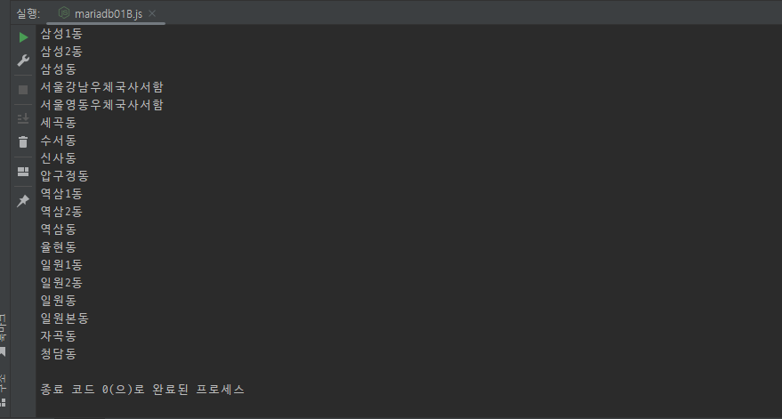<br>
